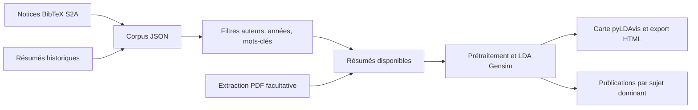

# Architecture et méthode

| Module | Responsabilité |
| --- | --- |
| `storage.py` | Validation et chargement des corpus JSON |
| `scraping.py` | Lecture des notices BibTeX et normalisation des métadonnées |
| `network.py` | Téléchargements bornés, TLS et redirections |
| `legacy.py` | Jointure des résumés historiques par identifiant HAL |
| `filtering.py` | Comparaisons normalisées et combinaison des critères |
| `pdf.py` / `corpus.py` | Extraction, exclusion des échecs et alignement texte/identifiant |
| `modeling.py` | Prétraitement, entraînement et export |
| `web.py` / `cli.py` | Interface locale et commandes reproductibles |

Le lecteur BibTeX couvre les champs présents dans les notices S2A, les accolades imbriquées, les valeurs entre guillemets et les accents LaTeX. Il parcourt chaque valeur sans interpréter les macros ou concaténations BibTeX générales. Ce choix a été vérifié sur la page réelle ; il ne constitue pas un importeur universel de bibliographies.

## Méthode et limites

Le moteur conserve le modèle LDA de Gensim du prototype : dix passes, `alpha="auto"`, graine 42. Les bigrammes et trigrammes sont appris sur le corpus. Le nombre de sujets est un paramètre utilisateur ; il n’est pas estimé automatiquement par BERTopic dans cette version.

Le mode de base nettoie les césures, tokenise, retire les mots vides anglais et une liste française intégrée, puis apprend les expressions fréquentes. La lemmatisation spaCy est optionnelle. Contrairement au prototype, le mode de base ne charge ni modèles spaCy ni corpus NLTK. Les termes scientifiques tels que « representation », « network » ou « attention » ne sont plus supprimés arbitrairement par la liste de mots vides.

Pour au moins dix documents, le dictionnaire conserve les termes présents dans au moins deux textes et dans au plus 90 % du corpus, avec un plafond de 10 000 termes. Pour les petits corpus, ce filtrage documentaire est désactivé : le seuil historique `no_above=0.5` vidait trop facilement le vocabulaire. Les textes vides après traitement sont exclus en conservant l’alignement des identifiants.

Ces modifications changent les sujets obtenus. La nouvelle application ne prétend pas reproduire numériquement les graphiques de 2025, même avec la même graine. Une comparaison scientifique exige le même corpus, le même prétraitement, les mêmes versions de dépendances et les mêmes paramètres. L’environnement de test est consigné dans `requirements/validated-windows-py311.txt`.

La carte pyLDAvis ne trie pas les sujets par taille (`sort_topics=False`) afin de conserver la correspondance avec le tableau des sujets dominants. L’ensemble des probabilités est calculé avant de choisir le sujet dominant. Les mots et les sujets restent des résultats exploratoires ; aucun score de précision ou d’amélioration scientifique n’est revendiqué.

## Exécution

Le serveur ne charge que les métadonnées au démarrage. Les calculs commencent à la soumission du formulaire. Les sélections restent dans la réponse ; une erreur de sélection ne produit pas une erreur interne du serveur. Un jeton de formulaire protège les soumissions et le mode debug est désactivé.

Les sorties ont des noms aléatoires propres à chaque analyse. Un verrou limite le processus Web à un calcul à la fois. Ce dispositif convient à une application locale, pas à un service public distribué. Les fichiers de sortie restent sur disque jusqu’à suppression manuelle.

## Références techniques

- [Publications S2A](https://s2a.telecom-paris.fr/publications/) : structure des notices utilisées pour la collecte.
- [Gensim](https://pypi.org/project/gensim/) : moteur LDA utilisé dans le projet.
- [API pyLDAvis](https://pyldavis.readthedocs.io/en/latest/modules/API.html) : préparation et export des visualisations.
- [actions/checkout](https://github.com/actions/checkout) et [actions/setup-python](https://github.com/actions/setup-python) : composants du workflow de vérification.
